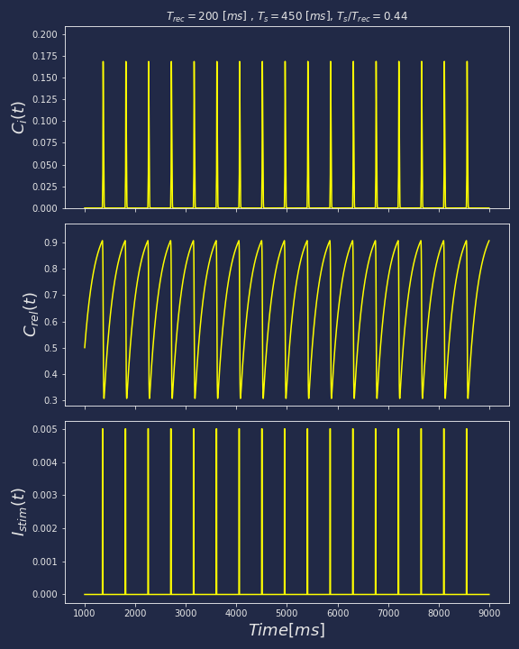

# UPC_Minimal_Calcium_Model

This repository contains files which implement a fourth order Runge-Kutta method to solve the system

$$
\dot{c}_j = I_{s}(t)+g_{rel}c_{rel}\frac{k_ac_j^2}{k_{om}+k_ac_j^2}(c_{SR}-c_j) - (c_j-c_o)/\tau_{diff}$$
$$\dot{c}_{rel} = k_{im}(1-c_{rel}) - k_ic_jc_{rel}
$$

The programs have some dependencies:

1. Python: requires **numba**, **os**, **sys** and **numpy**
2. Julia: requires **CSV** and **DataFrames**, These two packages are only used to save the results. Of course other methods can be used.
3. C: uses **cmath** and **iostream**.

To compile the C version I used `g++ -o calcium calcium.cc`.

## Usage.
The three versions take three arguments: $T_s$, $T_r$ and $N$.

$T_s$ and $T_r$ are the values in miliseconds of the stimulus current signal $I_s(t)$ and the recovery time $k_{im}=T_r^{-1}$. And $N$ is the number of beats to run. This means that the integration time is the interval $(0.0,NT_s)$

Thus, to use the programs:

C:
```console
$./calcium 400  500 20 > Ca.dat
```
This redirects the output to Ca.dat, which contains as columns: $t$, $c_j$, $c_{rel}$ and $I_s(t)$.  

Python:
 ```console
 $./caKi.py 400 500 20
 ```
This produces two files **KCa.npy** and **Kical.npy** which contain arrays with the solution and the stimulus. These can be accessed later using something like:
```
Sn = np.load('KCa.npy');
In = np.load('KIcal.npy');
t= Sn[:,0];
C=Sn[:,1];
q=Sn[:,2];
```


 Julia:
 ```console
 $./ca_rk.jl 400 500 20
 ```
This will produce a csv file **Ca_Results.csv** with colums corresponding to 
$t$, $c_j$, $c_{rel}$ and $I_s(t)$.

As described in the paper, depending of the relationshp between $T_s$ and $T_r$ the calcium concentration can exhibit different behaviours. As shown below for the cases $T_s = 450 ms$ and $T_r = 500$ and $200 ms$.


### Alternans


### Periodic release.



The former case show a 2:1 alternating regime. The latter, a regular periodic calcium release regime. ii